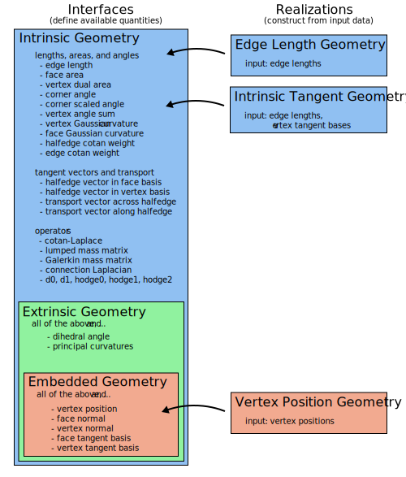

While the [halfedge mesh](../surface_mesh/basics.md) encodes the _connectivity_ of a surface, this section covers the classes which sit atop a halfedge mesh to define its _geometry_.

The first section below explains the class structure used to expose geometric logic, and the second section explains the system of automatically-cached quantities.

## Geometry hierarchy 


!!! TLDR "TL;DR"

    Construct a `VertexPositionGeometry` object using vertex positions; it offers all the geometric routines you would expect, and can be passed to any method that demands geometry.

    Many algorithms can actually operate on weaker data than vertex positions. Read on to learn more.


Geometry central is intentionally designed to allow flexibility in defining the geometry of a surface. Traditional code might assume a 3D position for every vertex, but many algorithms actually need only the _intrinsic geometry_ of a surface, aka the edge lengths. More generally, specifying algorithms to only use the geometric data they really need allows us to seamlessly leverage powerful techniques.

We (sparingly) make use of polymorphism via inheritance in C++ to encode a hierarchy of geometric quantities that one might compute for a surface. 

- **Interfaces** define which quantities can be computed from the geometry; for instance, an `EmbeddedGeometryInterface` can compute face normals, and it can also compute face areas because it extends the more basic `IntrinsicGeometryInterface`. Interfaces are abstract, and cannot be instantiated by themselves.
- **Realizations** are concrete classes that allow the user instantiate a geometry object from data; for instance, a `VertexPositionGeometry` can be constructed from vertex positions, and implements the `EmbeddedGeometryInterface` giving access to a wide range of intrinsic and extrinsic geometric quantities.

The following diagram outlines the interfaces and realizations currently available.



## Quantity management

### Immediate computation
In the most basic usage, realizations can compute simple quantities for a given element directly from input data. For instance, `double VertexPositionGeometry::faceArea(Face f)` will compute the area of a face.  However, this is _not_ the typical intended method for working with geometric quantities in geometry central.

### Managed quantities
A common pattern in geometry code is to maintain precomputed arrays of values that are used repeatedly (e.g. vertex normals). However, naive use of this pattern requires the programmer to coordinate these arrays throughout their codebase, or risk computing and storing the same array many times in distant subroutines. Geometry central embraces this pattern, and provides automatic support for proper use of it.

All geometry objects automatically maintain of system of caches for geometric quantities; the user can simply call (for instance) `geometry.requireFaceAreas()` at the beginning of a subroutine to ensure that the face area buffer is populated, then access `geometry.faceAreas[f]` in any subsequent code. This strategy keep storage and computation to a minimum by sharing repeated values across any use of the geometry object.

The following example demonstrates immediate computation vs cached quantities.
```cpp
VertexPositionGeometry& geometry = /* ... */;

// bad: immediate computation everywhere
for(Face f : mesh->faces()) {
	Vector3 normal = geometry.faceNormal(f);
}

// good: automatic caching and storage
geometry.requireFaceNormals();
for(Face f : mesh->faces()) {
	Vector3 normal = geometry.faceNormals[f];
}
```

In fact, the inheritance in this design allows geometry central to leverage alternate ways of computing a quantity depending on the underlying data available. For instance, face areas are computed for an `EdgeLengthGeometry` using Heron's rule, but for a `VertexPositionGeometry` a faster and more stable edge cross-product is used. Of course, this is all happening under the hood-- the user just needs to call `myGeometry.requireFaceAreas()`.

#### Dependencies
In addition, dependencies between these quantities are managed internally; for instance, if vertex normals are requested, face normals will be internally populated and used to compute vertex normals. However, these dependencies are internal and subject to change; the programmer should always explicitly call `geometry.requireFaceNormals()` if they intend to access face normals.

#### Updating
If the underlying geometric data changes (e.g., vertices are moved or the mesh is mutated), invoking `geometry.refreshQuantities()` will recompute all required values.

#### Minimizing storage usage
To minimize memory usage, invoke `geometry.unrequireFaceNormals()` at the conclusion of a subroutine to indicate that the quantity is no longer needed, decrementing an internal counter. The quantity is not instantly deleted after being un-required, but invoking `geometry.purgeQuantities()` will delete any quantities that are not currently required, reducing memory usage. Most users find that un-requiring and purging quantities is not necessary, and one can simply allow them to accumulate and eventually be deleted with the geometry object.

#### Quantity API

`#include "geometrycentral/surface/geometry.h"` to get all geometry interfaces.

All quantities offer methods and storage following the same naming pattern. For a quantity named `YYYs` (e.g. `faceAreas`), which is defined in an interface `GeometryInterface` (e.g. `IntrinsicGeometry`) the pattern is given below. 

An exauhstive list is given in [quantities](quantities.md).

??? func "`#!cpp MeshData<> GeometryInterface::YYYs`"
    The member variable array for quantity YYY. Initially empty, but can be populated with `requireYYYs()` below.

    For instance, for the quantity face areas, there is a member `FaceData<double> IntrinsicGeometry::faceAreas`.

??? func "`#!cpp void GeometryInterface::requireYYYs()`"
    Request that the buffer for quantity YYYs be populated. If it is already populated the method will return right away, otherwise the quantity will be computed.

    For instance, for the quantity face areas, one would call `IntrinsicGeometry::requireFaceAreas()`.

??? func "`#!cpp void GeometryInterface::unrequireYYYs()`"

    Indicate that the buffer for quantity YYYs no longer needs to be populated. Internally decrements a counter; once there is a `unrequireYYYs()` for every `requireYYYs()` call, the quantity can be purged by `GeometryInterface::purgeQuantities()`.

    For instance, for the quantity face areas, one would call `IntrinsicGeometry::unrequireFaceAreas()`.

    Note: most users find that un-requiring and purging quantities is not necessary, and one can simply allow them to accumulate and eventually be deleted with the geometry object. This functionality can be used only if reducing memory usage is very important.

??? func "`#!cpp T GeometryRealization::computeYYY(Element e)`"

    Immediate computation: rather than using the caching system described above, directly compute the value from the input data. 

    Only available for quantities which can be easily computed in O(1) from inputs (e.g. face normals), but not for quantities with significant dependencies (e.g. vertex normals, which depend on all incident face normals).

    For instance, face areas can be immediately computed with `double VertexPositionGeometry::faceArea(Face f)`.

    **Note:** immediate computation is generally only preferred if you are frequently changing the geometry; managed quantities are the primary method for computing geometric values.

In addition, the caching system provides two methods.

??? func "`#!cpp void GeometryInterface::refreshQuantities()`"
    Recompute all required quantities from the input geometric data.

    Should be called, for instance if vertices are moved or the underlying mesh is mutated.

??? func "`#!cpp void GeometryInterface::purgeQuantities()`"
    Delete all cached quantities which are not currently `require()`'d, reducing memory usage.

    Note: most users find that un-requiring and purging quantities is not necessary, and one can simply allow them to accumulate and eventually be deleted with the geometry object. This functionality can be used only if reducing memory usage is very important.

## Interfaces

*Interfaces* are abstract classes which define which quantities are available for a given geometry, and compute/manage caches of these quantities.

For the full list of the managed quantities that can be computed by these interfaces, see [the quantities section](quantities.md).


??? func "Base Geometry"

    #### Base Geometry

    Class: `BaseGeometryInterface`

    This is a simple base class which is serves as a parent of all geometry interfaces. It does not actually correspond to any geometric data, and the only quantities it manages are convenience element indices.

    `#!cpp #include "geometrycentral/surface/base_geometry_interface.h"`


??? func "Intrinsic Geometry"

    #### Intrinsic Geometry
    
    Class: `IntrinsicGeometryInterface`

    Extends `BaseGeometryInterface`. These quantites depend only on the notion of lengths and angles on the surface, but not how it might sit in space.

    `#!cpp #include "geometrycentral/surface/intrinsic_geometry_interface.h"`

    An intrinsic geometry can be instantiated via any of the realizations which inherit from it:

    - `EdgeLengthGeometry`
    - `VertexPositionGeometry` (additionally inherits from the child `EmbeddedGeometryInterface`)


??? func "Extrinsic Geometry"

    #### Extrinsic Geometry
    
    Class: `ExtrinsicGeometryInterface`

    Extends `IntrinsicGeometryInterface`. These quantites depend on extrinsic angles (like dihedral angles at edges), but are rotation-invariant.

    `#!cpp #include "geometrycentral/surface/extrinsic_geometry_interface.h"`

    An extrinsic geometry can be instantiated via any of the realizations which inherit from it:

    - `VertexPositionGeometry` (additionally inherits from the child `EmbeddedGeometryInterface`)

    Note that there is not currently any realization which instantiates an `ExtrinsicGeometryInterface` which is not also an `EmbeddedGeometryInterface`, but such a realization might one day exist.


??? func "Embedded Geometry"

    #### Embedded Geometry

    Class: `EmbeddedGeometryInterface`

    Extends `ExtrinsicGeometryInterface`. These quantites depend explicitly on how the surface sits in 3D space.

    `#!cpp #include "geometrycentral/surface/embedded_geometry_interface.h"`

    An embedded geometry can be instantiated via any of the realizations which inherit from it:

    - `VertexPositionGeometry`


## Realizations

*Realizations* construct a geometry object from input data. There are two widely used realizations in geometry central: [VertexPositionGeometry](#vertex-position-geometry) and [EdgeLengthGeometry](#edge-length-geometry).  Other realizations of geometry can be created as needed to make use of other kinds of data, ranging from small modifications to e.g. make use of predefined tangent spaces, to completely new geometries defined from alternate input data.

In addition to the quantities listed in [their own section](quantities.md), the realizations each offer a few immediate computations and some utility functions.

### Vertex Position Geometry

The usual notion of geometry for a mesh, with a position in 3D for each vertex. These positions are stored in the member `VertexPositionGeometry::vertexPositions` (which is inherited from the `EmbeddedGeometryInterface`). 

This class inherits from all of the geometry interfaces mentioned above, so all quantities will be available.

`#!cpp #include "geometrycentral/surface/vertex_position_geometry.h"`

??? func "`#!cpp void VertexPositionGeometry::VertexPositionGeometry(VertexData<Vector3> positions)`"

    Construct a new geometry from vertex positions.

    The `positions` input is copied, and stored in the member `VertexPositionGeometry::vertexPositions`.


??? func "`#!cpp void VertexPositionGeometry::VertexPositionGeometry(SurfaceMesh& mesh)`"

    Construct a new geometry for the mesh, with all positions set to the origin `Vector3{0., 0., 0.,}`.


??? func "`#!cpp void VertexPositionGeometry::VertexPositionGeometry(SurfaceMesh& mesh, const VertexData<Vector3>& positions)`"

    Construct a new geometry for a mesh from known vertex positions.

    The `positions` input is copied, and stored in the member `VertexPositionGeometry::vertexPositions`.


??? func "`#!cpp void VertexPositionGeometry::VertexPositionGeometry(SurfaceMesh& mesh, const Eigen::MatrixBase<T>& positions)`"

    Construct a new geometry for a mesh from known vertex positions, where the positions are stored as an Eigen matrix.

    The input matrix should be a `Vx3` matrix of floating point values. The `Eigen::MatrixBase` type is just a generic type which accepts most Eigen matrices as input, including the geometry-central `DenseMatrix<>` type.


??? func "`#!cpp std::unique_ptr<VertexPositionGeometry> VertexPositionGeometry::copy()`"

    Copy the geometry, creating a new identical geometry on the same mesh. Any `require()` counts or already-computed quantities are not transferred, the new geometry is a blank slate.


??? func "`#!cpp std::unique_ptr<VertexPositionGeometry> VertexPositionGeometry::reinterpretTo(SurfaceMesh& targetMesh)`"

    Copy the geometry, creating a new identical geometry on `targetMesh`. The target mesh must be in vertex-correspondence with the input mesh, in the sense that both meshes have the same number of vertices and iterating through the vertex sets yields matching vertices.
    
    Any `require()` counts or already-computed quantities are not transferred, the new geometry is a blank slate.


*Immediate computations*. These routines directly compute geometry quantities from the input data, without touching the caching system. For the full list of available managed quantities, see [the quantities section](quantities.md).
  
??? func "`#!cpp double VertexPositionGeometry::edgeLength(Edge e)`"

    Compute the length of a single edge.

??? func "`#!cpp double VertexPositionGeometry::faceArea(Face f)`"

    Compute the area of a single face.

??? func "`#!cpp double VertexPositionGeometry::cornerAngle(Corner c)`"

    Compute the angle (in radians) formed by the two edges incident on a corner.

??? func "`#!cpp double VertexPositionGeometry::halfedgeCotanWeight(Halfedge he)`"

    Compute the *cotangent weight* of a hafedge.

??? func "`#!cpp double VertexPositionGeometry::edgeCotanWeight(Edge e)`"

    Compute the *cotangent weight* of an edge.

??? func "`#!cpp Vector3 VertexPositionGeometry::faceNormal(Face f)`"

    Compute the normal of a face.


### Edge Length Geometry

A weaker notion of geometry where one knows only edge lengths. This data turns out to be sufficient to implement many algorithms in geometry processing, and offers valuable flexibility in defining the geometry.

This class inherits from the `IntrinsicGeometryInterface`, so only intrinsic quantities will be available.

`#!cpp #include "geometrycentral/surface/edge_length_geometry.h"`

??? func "`#!cpp void EdgeLengthGeometry::EdgeLengthGeometry(SurfaceMesh& mesh, EdgeData<double> edgeLengths)`"

    Construct a new geometry for a mesh from known edge lengths.

    The `edgeLengths` input is copied, and stored in the member `EdgeLengthGeometry::edgeLengths` (inherited from `IntrinsicGeometryInterface`).


??? func "`#!cpp std::unique_ptr<EdgeLengthGeometry> EdgeLengthGeometry::copy()`"

    Copy the geometry, creating a new identical geometry on the same mesh. Any `require()` counts or already-computed quantities are not transferred, the new geometry is a blank slate.


??? func "`#!cpp std::unique_ptr<EdgeLengthGeometry> reinterpretTo(SurfaceMesh& targetMesh)`"

    Copy the geometry, creating a new identical geometry on `targetMesh`. The target mesh must be in edge-correspondence with the input mesh, in the sense that both meshes have the same number of edges and iterating through the edge sets yields matching edges.
    
    Any `require()` counts or already-computed quantities are not transferred, the new geometry is a blank slate.


*Immediate computations*. These routines directly compute geometry quantities from the input data, without touching the caching system. For the full list of available managed quantities, see [the quantities section](quantities.md).
  

??? func "`#!cpp double EdgeLengthGeometry::faceArea(Face f)`"

    Compute the area of a single face.

??? func "`#!cpp double EdgeLengthGeometry::cornerAngle(Corner c)`"

    Compute the angle (in radians) formed by the two edges incident on a corner.

??? func "`#!cpp double EdgeLengthGeometry::halfedgeCotanWeight(Halfedge he)`"

    Compute the *cotangent weight* of a hafedge.

??? func "`#!cpp double EdgeLengthGeometry::edgeCotanWeight(Edge e)`"

    Compute the *cotangent weight* of an edge.
