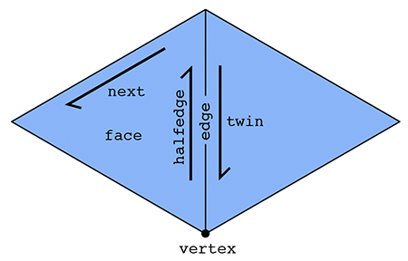
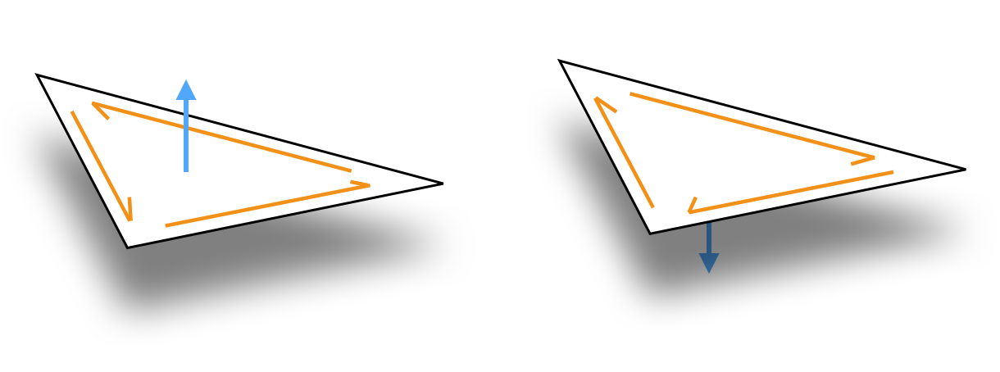

The `SurfaceMesh` is the workhorse data structure for representing surface in geometry-central. Internally, it is reference-based mesh (similar to halfedge mesh), and can hold general polygonal meshes (though many routines only support triangle meshes). `SurfaceMesh` offers wide support for things like iterating around a mesh, modifying a mesh, and associating data with a mesh via containers. Under the hood, it is implemented with dense, automatically resizing buffers for efficient performance.

```
#include "geometrycentral/surface/surface_mesh.h"
#include "geometrycentral/surface/manifold_surface_mesh.h"
```

??? warning "Old `HalfedgeMesh` type"

    In a previous version of `geometrycentral`, the mesh type was simply called `HalfedgeMesh`, and only supported manifold meshes. This type as been renamed to `ManifoldSurfaceMesh`.

    Including `geometrycentral/surface/halfedge_mesh.h` will simply typedef `HalfedgeMesh` as `ManifoldSurfaceMesh`, so most existing code will still work unchanged; new code should use `ManifoldSurfaceMesh`.

## General vs. Manifold Surface Meshes

There are variants of the surface mesh class; the more general `SurfaceMesh` which can hold any very general polygonal mesh, and the more specific `ManifoldSurfaceMesh`, which only supports manifold, oriented meshes.

Beyond the general capabilities of a `SurfaceMesh`, the `ManifoldSurfaceMesh`:

- inherits from `SurfaceMesh`, and can be used anywhere a `SurfaceMesh` is expected
- supports additional operations which require a manifold structure
- internally uses a more efficient representation

There are also a small number of operations which might throw an error if called on a `ManifoldSurfaceMesh`, and should be used only on the more general `SurfaceMesh`. In particular, mutations which would make the mesh nonmanifold.

!!! note "Nonmanifold Meshes"

    Support for general, possibly nonmanifold surface meshes is a recent addition to geometry-central. We are still gradually porting routines from supporting `ManifoldSurfaceMesh` to the more general `SurfaceMesh` where appropriate!


## Element types

The `SurfaceMesh` also comes with a collection of lightweight types serving as logical references, or "handles" to mesh elements: `Vertex`, `Halfedge`, `Edge`, `Corner`, `Face`, and `BoundaryLoop` (`ManifoldSurfaceMesh` only). These handles are essentially just a typed wrapper around an ID for the element.  Deleting one of these handles does not delete the underlying element, and one may have many distinct handles to the same element `Vertex a; Vertex b; a == b;`.


### Mesh connectivity

Generally, you can (and should) interact with the mesh via [higher-level, abstracted routines](/surface/surface_mesh/navigation). However, this section details the low-level relationships between these handles. Note that on a `ManifoldSurfaceMesh`, the guarantees about these relationships are much stronger than on a more general `SurfaceMesh`.

The primary type in our halfedge-based mesh is a _halfedge_, in addition to the usual _vertex_, _edge_ and _face_ types. A halfedge is a directed edge incident on a face, as shown below. 

On a `ManifoldSurfaceMesh`, two halfedges, oriented in opposite directions, make up each edge in the mesh. Each halfedge has relationships with five adjacent elements: 

- `Halfedge::twin()` the other halfedge across the incident edge
- `Halfedge::next()` the next halfedge in clockwise order around the incident face
- `Halfedge::vertex()` the vertex at the tail (back) of the halfedge
- `Halfedge::edge()` the incident edge
- `Halfedge::face()` the incident face



On a more general `SurfaceMesh`, rather than a single twin, the `Halfedge::sibling()` referene orbits around all other halfedge incident on the edge, which might point in the same or the opposite direction.

Each vertex, edge, and face need just one relationship:

- `Vertex::halfedge()` _any_ of the incident halfedges (which point outward from the vertex)
- `Edge::halfedge()` _any_ of the incident halfedges
- `Face::halfedge()` _any_ of the incident halfedges

In fact, these relationships is sufficient to implement pretty much _any_ local traversal. Geometry central provides a wide range of convience iterators which wrap these relationships to traverse neighborhoods (see [navigation](/surface/surface_mesh/navigation)).

```cpp
for(Edge e : vertex.adjacentEdges()) {
  // do science
}
```


## Manifold, Oriented Surfaces

The `ManifoldSurfaceMesh` mesh imposes two requirements: manifoldness and orientation. 

Manifoldness means that our surface must locally look like a plane in any neighborhood. This disallows structures such as three faces meeting at an edge, or two cones of faces meeting at a single vertex like an hourglass. 

Furthermore the halfedge mesh implies a combinatorial _orientation_ of the surface, indicated by the clockwise ordering of halfedges around each face (see figure below). Because the halfedge mesh implies an orientation, it cannot represent non-orientable surfaces, like a Klein bottle.



These properties are invariants which always hold for the `ManifoldSurfaceMesh`; in practice we check them during construction and ensure that all operations preserve them.

## Basic API

### Constructors

See the [mesh I/O page](/surface/utilities/io) for helpers which read a mesh from file, and factory methods to construct a mesh and geometry simultaneously.

??? func "`#!cpp SurfaceMesh(const std::vector<std::vector<size_t>>& polygons)`"
    Constructs a mesh from a face-index list.

    - `polygons` a list of faces, each holding the indices of the vertices incident on that face, zero-indexed and in counter-clockwise order.


??? func "`#!cpp ManifoldSurfaceMesh(const std::vector<std::vector<size_t>>& polygons)`"

    Same as above, but constructs a manifold surface mesh.


??? func "`#!cpp SurfaceMesh(const Eigen::MatrixBase<T>& faces)`"

    Constructs a mesh from a rectangular face-index matrix, like an `Fx3` array of triangle indices, or an `Fx4` array of quad indices. The matrix scalar can be any integer type, like `size_t` or `int`.

    The `Eigen:MatrixBase<T>` type is just a general type which accepts most Eigen matrix types as input, including geometry-central's nicely-named wrapper `DenseMatrix<T>`.


??? func "`#!cpp ManifoldSurfaceMesh(const Eigen::MatrixBase<T>& faces)`"
    
    Same as above, but constructs a manifold surface mesh.


??? func "`#!cpp ManifoldSurfaceMesh(const std::vector<std::vector<size_t>>& polygons, const std::vector<std::vector<std::tuple<size_t, size_t>>>& twins)`"

    Constructs a mesh from a face-index list, and extra data specifying the neighboring face across each face-side. This extra data allows you to describe meshes where there are multiple, distinct edges between some pair of vertices

    - `polygons` a list of faces, each holding the indices of the vertices incident on that face, zero-indexed and in counter-clockwise order.
    
    - `twins` a list of tuples, in correspondence with the `polygons` list. For each side of a face, it holds an `(iF, iS)` tuple, where `iF` is the index of the face across the edge, and `iS` is the side of that face (e.g. the `iS = 2` for the third side of a triangle). Set both tuple elements to `INVALID_IND` for boundary sides.
 

### Element counts

Remember, all functions from `SurfaceMesh` can also be called on `ManifoldSurfaceMesh`.

??? func "`#!cpp size_t SurfaceMesh::nVertices()`"
    Returns the number of vertices. 

??? func "`#!cpp size_t SurfaceMesh::nInteriorVertices()`"
    Returns the number of vertices not incident on the boundary.

??? func "`#!cpp size_t SurfaceMesh::nBoundaryVertices()`"
    Returns the number of vertices incident on the boundary.

??? func "`#!cpp size_t SurfaceMesh::nEdges()`"
    Returns the number of edges. 

??? func "`#!cpp size_t SurfaceMesh::nFaces()`"
    Returns the number of faces in the mesh.

??? func "`#!cpp size_t SurfaceMesh::nHalfedges()`"
    Returns the number of halfedges, including both interior halfedges and any exterior halfedges incident on boundary loops. Always exactly twice the number of edges.

??? func "`#!cpp size_t SurfaceMesh::nInterioHalfedges()`"
    Returns the number of interior halfedges, which are incident on faces of the mesh. Always equal to the sum of the number of sides of all faces.

??? func "`#!cpp size_t SurfaceMesh::nExteriorHalfedges()`"
    Returns the number of exterior halfedges, which are opposite boundary faces. 

??? func "`#!cpp size_t SurfaceMesh::nBoundaryLoops()`"
    Returns the number of distinct boundary loops in the mesh, each identified as an fictional face closing a boundary loop in the mesh.


### Properties

??? func "`#!cpp bool SurfaceMesh::hasBoundary()`"
    Returns true if the mesh has boundary, that is if it is not _closed_.
    
    Complexity $\mathcal{O}(1)$.

??? func "`#!cpp int ManifoldSurfaceMesh::eulerCharacteristic()`"
    Returns the Euler characteristic of the surface. Computed in O(1) from element counts. 
    
    **Note:** always computed by naively applying [Euler's polyhedron formula](https://en.wikipedia.org/wiki/Euler_characteristic#Polyhedra), which might not do what you want in the case of multiple-connected components.

??? func "`#!cpp int ManifoldSurfaceMesh::genus()`"
    Returns the genus of the surface. Computed in O(1) from element counts.
    
    **Note:** always computed by naively applying [Euler's polyhedron formula](https://en.wikipedia.org/wiki/Euler_characteristic#Polyhedra), which might not do what you want in the case of multiple connected components.

??? func "`#!cpp bool SurfaceMesh::isManifold()`"

    Returns true if the mesh is both edge- and vertex- manifold.

    Note that there is no `isVertexManifold()`, because a mesh which is edge-nonmanifold is always also vertex-nonmanifold.

??? func "`#!cpp bool SurfaceMesh::isEdgeManifold()`"

    Returns true if the mesh is edge-manifold. 

??? func "`#!cpp bool SurfaceMesh::isOriented()`"

    Returns true if all faces have consistent orientations.

??? func "`#!cpp bool SurfaceMesh::isTriangular()`"
    Returns true if all faces in the mesh have 3 sides. 
    
    Complexity $\mathcal{O}(n)$, do not call in a tight loop.

??? func "`#!cpp size_t SurfaceMesh::nConnectedComponents()`"
    Returns the number of distinct connected components of the mesh. 
    
    Complexity $\mathcal{O}(n)$, do not call in a tight loop.


### Utility functions   
  
??? func "`#!cpp std::vector<std::vector<size_t>> SurfaceMesh::getFaceVertexList()`"

    Return a listing of the vertex indices incident on each face.


??? func "`#!cpp DenseMatrix<T> SurfaceMesh::getFaceVertexMatrix()`"

    Return a dense `F x D` matrix of the vertex indices for each face in the mesh.  All faces in the mesh must have the same degree `D`.
    
    This function is templated on the scalar type for the resulting matrix, so call it like
    ```cpp
    DenseMatrix<size_t> F = mesh->getFaceVertexMatrix<size_t>();
    ```
    to get a matrix where each entry is a `size_t`, or like
    ```cpp
    DenseMatrix<int> F = mesh->getFaceVertexMatrix<int>();
    ```
    to get a matrix where each entry is an `int`.

    Remember that `DenseMatrix<T>` is just our nice synonym for `Eigen:::Matrix`.

??? func "`#!cpp std::unique_ptr<SurfaceMesh> SurfaceMesh::copy() const`"

    Construct a copy of the mesh. 


??? func "`#!cpp std::unique_ptr<ManifoldSurfaceMesh> ManifoldSurfaceMesh::copy() const`"

    Construct a copy of the mesh. 


??? func "`#!cpp std::unique_ptr<SurfaceMesh> SurfaceMesh::copyToSurfaceMesh() const`"

    Construct a copy of the mesh. The underlying type will be the same as the underlying type of the mesh on which it is called.


??? func "`#!cpp std::unique_ptr<ManifoldSurfaceMesh> SurfaceMesh::toManifoldMesh()`"

    Convert the mesh to `ManifoldSurfaceMesh`, which is certainly manifold and oriented.

    Throws an error if the mesh is not manifold and oriented.
