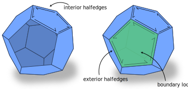

Mesh boundaries in halfedge meshes are modelled by logically treating each _boundary loop_ as if it were a face with an associated set of halfedges. These halfedges incident on boundary loops are referred to as _exterior halfedges_, while the usual halfedges incident on faces actually present in the mesh are _interior halfedges_. Any boundary edge of the mesh will have one interior and one exterior halfedge incident upon it.



!!! note "Manifold Surfaces Only"

    This section largely only applies to `ManifoldSurfaceMesh`, which has well-defined boundary loops. On a general `SurfaceMesh`, you can test if an element is along the boundary (like `edge.isBoundary()`), but not much else.


## Exterior halfedges

Nearly all routines involving halfedges include both interior and exterior halfedges, as this is most often what is needed in algorithms. `HalfedgeData<>` containers can hold data on exterior halfedges, and iterators (like `Vertex::outgoingHalfedges`) will iterate over both interior and exterior halfedges.

A few routines explicitly indicate whether they process interior halfedges, exterior halfedges, or both, such as `ManifoldSurfaceMesh::nInteriorHalfedges()`.

??? func "`#!cpp bool Halfedge::isInterior()`"
    **Return:** true if the halfedge is an interior halfedge, and false if it is an exterior halfedge.


## Faces and boundary loops

The separate type `BoundaryLoop` is used to represent boundary loops, and offers all functionality of other element types. For instance, the `BoundaryLoopData<>` container can be used to associate data with boundary loops, and `BoundaryLoop::adjacentVertices()` can be used to iterate over the vertices along a boundary component.

Since boundary loops act like faces in the mesh connectivity, traversing the mesh might yield a "face" referring to what is really a boundary loop. In particular, calling `Halfedge::face()` on an exterior halfedge will yield the "face" which is its boundary loop.  However, this "face" is a lie, we have not really _added_ a face to the mesh: `ManifoldSurfaceMesh::nFaces()` will still report the actual number of faces, etc.  The only valid thing to do with a `Face` which actually a boundary loop is to immediately convert it to a `BoundaryLoop`, See the example below.

```cpp
Halfedge myHe = /* some exterior halfedge */;
assert(myHe.isInterior() == false); // this is an exterior halfedge

// Traverse to "face"
Face bFace = myExteriorHalfedge.face();

// bFace is really a boundary loop, doing any face things 
// with it would be invalid
assert(bFace.isBoundaryLoop() == true);

// Convert the "face" to its true boundary loop form 
BoundaryLoop bLoop = bFace.asBoundaryLoop();

// Now we can do all kinds of things with it
for(Edge e : bLoop.adjacentEdges()) {
  /* do science */
}
```

??? func "`#!cpp bool Face::isBoundaryLoop()`"

    Returns true if the face is really a boundary loop.


??? func "`#!cpp BoundaryLoop Face::asBoundaryLoop()`"

    Convert a face to the equivalent boundary loop. Only valid to call on a face for which `Face::isBoundaryLoop() == true`.


??? func "`#!cpp Face BoundaryLoop::asFace()`"

    Convert a boundary loop back to its equivalent face. The inverse of `Face::asBoundaryLoop()`. Rarely used.


## Element boundary properties

The previous sections describe elements which *make up* the boundary of a mesh. The methods here identify elements which merely lie along the mesh boundary.


??? func "`#!cpp bool Vertex::isBoundary()`"

    Returns true if the vertex is on the boundary. A vertex is on the boundary if any of its incident edges are boundary edges. $O(1)$.


??? func "`#!cpp bool Edge::isBoundary()`"

    Returns true if the edge is on the boundary. An edge is on the boundary if either of its incident halfedges are exterior halfedges. $O(1)$.

    Note that only edges which lie entirely along a boundary are considered boundary edges. Edges which "point at" the boundary and touch the boundary only at one endpoint are not considered boundary edges by this function.

