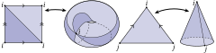

 
!!! TLDR "TL;DR"

    This section clarifies some formal mathematical ideas that may arise in advanced usage of the halfedge mesh class. **If you are simply loading up a triangle mesh and running an ordinary geometry processing algorithm, you need not worry about these details---everything will behave as expected**.

    If you are implementing intrinsic triangulation algorithms, doing an unreasonable number of edge flips, or are simply curious: read on!

## Introduction

Halfedge meshes are often used to represent *simplicial complexes*. When you're thinking about a triangle mesh, you probably imagine a simplicial complex: each face has three distinct vertices and three distinct edges, each edge connects two distinct vertices, and there can be at most one edge between any pair of vertices.

In fact, halfedge meshes (unlike many other mesh representations) can actually represent more general structures than just simplicial complexes. Halfedges meshes can represent any (oriented, manifold) $\Delta$-complex[^1]. Intuitively, the $\Delta$-complex relaxes the restriction that incident elements be unique:
[^1]: see Section 2.1 of *Algebraic Topology* by Allen Hatcher

- a face may be incident on the same vertex multiple times
- an edge may connect a vertex to itself
- there may be multiple edges between a pair of vertices

However, the $\Delta$-complex still requires that every faces has 3 sides, and the manifold restriction still means that the complex looks like a surface in any local neighborhood. Recall that we are only concerned with the _connectivity_ of these surfaces, not how they sit in space: these general $\Delta$-complexes might be impossible to embed with straight edges between vertex positions in $\mathbb{R}^3$, but that does not bother us right now.

The following surfaces are $\Delta$-complexes but not simplicial complexes:

## That sounds complicated, why would you do that? 

Don't forget, $\Delta$-complexes are a superset of simplicial complexes, so everything that works on general $\Delta$-complexes will work on a plain old triangle mesh too. Buy why go to the extra trouble to support general $\Delta$-complexes in geometry central?

General $\Delta$-complexes allow extremely powerful algorithms for _intrinsic_ geometry processing. Most famously, the [_intrinsic Delaunay_ formulation](https://arxiv.org/abs/math/0503219)[^2] builds a Laplace operator for an input triangle mesh which has fantastic numerical and computational properties, and the algorithm requires representing a $\Delta$-complex as an intermediate step. More generally, [intrinsic triangulations](http://www.cs.cmu.edu/~kmcrane/Projects/NavigatingIntrinsicTriangulations/paper.pdf)[^3] enable computational geometry algorithms like Delaunay refinement on triangle meshes, so long as long as one can represent $\Delta$-complexes which arise in intermediate steps. In both of these examples, features like self-edges are rare, and do not occur on most inputs. However, supporting them is necessary for the robustness and correctness of the algorithm.

[^2]: Bobenko, Alexander I., and Boris A. Springborn. _A discrete Laplace–Beltrami operator for simplicial surfaces._ Discrete & Computational Geometry (2007)
[^3]: Sharp, Nicholas and Soliman, Yousuf and Crane, Keenan.  _Navigating Intrinsic Triangulations_.  ACM Trans. Graph. (2019)

Fortunately, working in a software library which already supports the nuances of $\Delta$-complexes means these powerful algorithms can be implemented with little additional work.

## Software support

The halfedge mesh class in geometry central is explicitly designed to ensure support for $\Delta$-complexes, rather than just simplicial complexes. Mostly, this is a natural consequence of the halfedge mesh formulation, but special care is needed for a few operations like [mutations](mutation.md) and [automatically written to file](/surface/utilities/io/#rich-surface-mesh-data). Wherever relevant, the API will note its special properties with respect to $\Delta$-complexes. 

