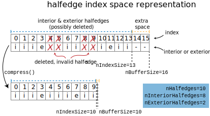

# Halfedge mesh internals

This section contains details about the internal implementation of the halfedge mesh data structure. Typical users should not need to care about these details, but they may be useful for extension and debugging.

The halfedge mesh structure is designed to simultaneously satisfy two core principles:

1. **contiguous storage:** elements and mesh data are stored in flat buffers of memory. This makes traversing and storing data on the mesh fast.
2. **O(1) updates:** dynamic operations that add and remove new elements must be supported in (amortized) constant time. This makes modifying the mesh fast.

The solution to these two requirements is a dynamically-resizing, array-based mesh. Like a `std::vector`, elements are stored in contiguous buffers of memory, which are transparently expanded and copied sporadically. Of course, this expansion is largely hidden from the user.

Philosophically, our halfedge mesh aims to be _as-implicit-as-possible_: whenever we can, we represent connectivity and properties implicitly by indices. Although this strategy runs the risk of being "overly clever" programming, it has proven effective for two reasons. First, anything tracked explicitly and stored an array is a liability if that array is not updated properly---conversely implicit relationships can be abstracted away behind helper functions, and need not be carefully maintained. Second, implicit relationships tend to lead fast implementations out of the box, avoiding performance hacking which runs a huge risk of breaking correctness.

## Permutation halfedge mesh

Here's a neat fact: a halfedge mesh can be represented by a single [permutation](https://en.wikipedia.org/wiki/Permutation) of length `nHalfedges`. 

How? First, consider an enumeration of the halfedges. We can implicitly encode the `twin()` relationship by storing twinned halfedges adjacent to one another-- that is, the twin of an even-numbered halfedge numbered `he` is `he+1`, and the twin of and odd-numbered halfedge is `he-1`. We then use the permutation to encode the `next()` relationships. The faces are the [orbits](https://en.wikipedia.org/wiki/Permutation#Cycle_notation) of the `next()` operation, enumerated in the order they are encountered. The edges are the orbits of the `twin()` operation, which can be enumerated implicitly from the index. The vertices are the orbits of the `twin().next()` operation, again enumerated in the order they are encountered.

This idea of a permutation is essentially the representation used for our halfedge mesh data structure: a single permutation array encodes the `next()` map, while the `twin()`, `edge()`, and `edge.halfedge()` maps are implicitly defined. However, although vertices and faces _could_ be represented implicitly by an enumeration of orbits, doing so is inconvenient and expensive to update. Instead, we include additional arrays storing the `he.vertex()`, `he.face()`, `v.halfedge()` and `f.halfedge()` maps which are explicitly maintained.

## Basic structures

Our halfedge mesh is index-based. Each {halfedge,edge,vertex,face} is identified by a 0-based index. The `SurfaceMesh` class then holds the following explicit arrays encoding the connectivity between these indexed elements (the remaining relationships are implicitly defined).

```
class SurfaceMesh {
  ...
  private:
    std::vector<size_t> heNext;     // for he.next()
    std::vector<size_t> heVertex;   // for he.vertex()
    std::vector<size_t> heFace;     // for he.face()
    std::vector<size_t> vHalfedge;  // for v.halfedge()
    std::vector<size_t> fHalfedge;  // for f.face()
  ...
};
```

The `Halfedge`, `Vertex`, etc. classes serve as typed wrappers referring to a mesh element. These wrappers store the index of the underlying element, as well as pointer to the mesh object itself. Traversal operations like `he.next()` are either implemented implicitly via index arithmetic, or by lookup in to the appropriate array.
```
class Halfedge {
  ...
  size_t ind;
  SurfaceMesh* mesh;
  Halfedge next() { return Halfedge{mesh->heNext[ind], mesh}; }   // explicit
  Halfedge twin() { return Halfedge{ind ^ 1, mesh}; }             // implicit
  ...
};
```

!!! info "Why not pointers?"
    One potential drawback to the index-based design is that each element must store its index as well as a pointer to the underlying mesh data structure. For instance, the smallest possible data layout of `Halfedge` would look something like ` struct Halfedge { size_t ind; SurfaceMesh* mesh; };`, because the `ind` is useless unless we know what arrays to index in to (e.g., to implement `next()`).

    This extra storage could be avoided by replacing `size_t ind` with a pointer directly to memory encoding data about the halfedge. This design would reduce the `sizeof(Halfedge)` from 16 bytes to 8, as well as potentially avoiding some offset index instructions. So why don't we do that instead?

    In fact, the first implementation of this library used exactly that pointer-based design. However, it turned out to have two main downsides:

    - **semantics of pointer invalidation:** In C++, doing nearly anything with an invalid pointer incurs undefined behavior, and expanding our buffers invalidates pointers. This meant that an "under the hood" resize event would invalidate all of the user's `Halfedge` objects, necessitating frequent expensive use of `DynamicHalfedge`, rather than just around `compress()` as in the current design.  
    - **implementation complexity:** Working with raw pointers makes a lot of easy things hard. Significant pointer gymnastics were needed to internally implement resize operations without running afoul of invalid pointer rules. Simple operations like copying meshes and mesh data required pointer translation. Indexing in to a container essentially required a dense index from the element, so the codebase ended up littered with operations to construct indices from pointer offsets. The cumulative effect was quite error-prone.

    Ultimately, the index-based design seems preferrable.

## Invariants

In addition to the basic properties of the `twin()` and `next()` maps, the halfedge mesh data structure offers a few useful invariants about its indexing scheme which must be maintained by all operations.

  - on a boundary edge, `e.halfedge()` is the interior halfedge
  - on a boundary vertex, `v.halfedge()` is the unique real interior halfedge along the boundary (so `v.halfedge().twin()` is necessarily exterior, and traversing in CCW order walks the wedge)


The `validateConnectivity()` function is extremely useful for checking invariants while developing the data structure.

??? func "`#!cpp void SurfaceMesh::validateConnectivity()`"

    Perform _a lot_ of sanity checks about the halfedge mesh. Throws if any fail.

## Resizing and deleting

To enable (amortized) $\mathcal{O}(1)$ mutation, the buffers containing mesh data are lazily reallocated like a `std::vector` when needed. As such the actual buffers like `mesh.heNext` might be larger than the current number of elements in the mesh; we separately track the count of real, valid elements to avoid accessing the extra regions of the array. The special index value `INVALID_IND` (which happens to be `std::numeric_limits<size_t>::max()`) is used to fill index values that have no meaning.

A similar issue arises with deletion. When a mesh element is deleted, it would be too expensive to shift the indices of all subsequent elements. Instead, we simply mark the element as deleted, leaving a hole in our index space. Deleted halfedges and their edges are implicitly encoded by `heNext[he] == INVALID_IND`, while deleted edges and vertices are encoded by `vHalfedge[v] == INVALID_IND` and `fHalfedge[f] == INVALID_IND`.

Thus at any point in time, some indices may be invalid elements, left from previous deletions, and other array entries might correspond to extra elements allocated during the last resizing, waiting to be used. In all iterators and counts, explicit logic ensures that invalid elements are skipped. Traversal functions do not need any such logic, as it should be impossible to traverse from a valid element to an invalid element. The `SurfaceMesh::compress()` function is provided to re-index all mesh elements, and ensure a dense packing with no deleted elements.

The following diagram lays out what this index space might look like.



### General Surface Meshes

To represent more general surfaces meshes which might be nonmanifold or oriented, we augment our representation with a few extra arrays of data. In particular, we depart from implicit indexing schemes, and explicitly store halfedge siblings and edges, as well as each edge's halfedge. We also store an orientation bit for each halfedge along its edge, and and in implicit linked list of halfedges incident on each vertex. The last of which is particularly unsatisfying, but otherwise iterating around vertices is quite difficult.

### Exterior boundary elements

(`ManifoldSurfaceMesh` only)

One complexity in our implementation is the existence of exterior boundary elements. Recall that boundaries of our mesh are represented by filling each hole with a single, many-sided boundary loop; the halfedges incident on this face are "exterior". This definition is convenient because it saves us from constantly special-casing elements on the boundary, but introduces some complexity because the user probably doesn't want to think about these boundary loops as faces most of the time.

Exterior halfedges are enumerated alongside their interior counterparts, and generally are treated just like normal interior halfedges; most routines do not distinguish between the two.


In contrast, although boundary loops are just faces internally, the API provides the illusion that they are a distinct type from the faces of the mesh. To enable this treatment, boundary loops are always stored at the _back_ of the face index space. In general, the layout of the allocated index space will consist of first actual mesh faces, then any extra not-yet-used space, and finally boundary loops. 

## Resize callbacks

As the halfedge mesh is mutated, all `MeshData<>` containers automatically resize to stay in sync. This is implemented under the hood with a system of callback functions registered with the mesh itself. Whenever the mesh resizes or compresses one of its index spaces, it invokes a callback for each associated `MeshData<>` to do the same.

`DynamicHalfedge` and friends also register themselves with the callback system, to stay valid as the mesh resizes. However, this results in a callback per dynamic element, which is why the dynamic elements are more expensive. Fortunately, dynamic elements can be used sparingly.
